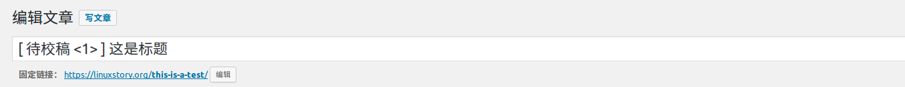

title: LinuxStory 校稿指南

## 文档说明

本文档属于 LinuxStory 校稿团队必读标准。所有校稿人员必须熟悉本文档所有内容，并严格按照该份文档执行校稿任务。
本文档从以下几个方面分别阐述了审校的规范。

## 审校规范

### 一、格式规范

> 注意：本部分属于译者，校稿者均需要阅读的内容，译者按照该规范贴文，校稿者按照该标准审阅。

1、标题设置
译者将文章放置到后台时，需要严格按照编辑手册进行。然后在标题上添加待校稿字样，并标明紧急程度（数字越小越紧急，请合理划分紧急程度）。

2、文章摘要
译者需要根据文章的主旨提炼出文章摘要，并将摘要放置到摘要框中。要求摘要不能太少，也不能过多。50字左右最佳。

3、特色图片
考虑到 LinuxStory 当前排版的特性，以及美观可读性。 LinuStory 的文章要求必须含有特色图片。请选择清晰，符合文章内容的特色图片。

4、标签设置
给文章贴上合理的标签，便于用户、机器的搜索。所以每篇文章我们应该设立几个贴合内容的标签。注意：标签不宜过长，英文名词一定要保证大小写合适。严禁出现较长的中文。

5、文章分类
LinuxStory 文章越来越丰富，对于每一篇文章我们要做好分类处理。目前已经有许多分类，一般来说你不需要再创建新的类别。当你达到需要创建类别的时候，我相信你已经能创建了。
> 一般来说将文章归为一个分类。

6、文章格式
- 段落与段落之间不要可以去添加空行，优雅的使用 markdown 即可保障空白得当。
- 不要在段落的开头添加缩进，直接顶格就好。
- 中文字符与英文字符交界处有且仅有一个空格。
- 文章可以适当使用粗体、斜体等强调内容。注意避免过多的强调。容易让读者抓不住重点。
- 文章尽量图文并茂，但是要求图文的质量一定要好。
- 文末根据文章的性质附上链接（翻译文章，附上原文链接；投稿，附上投稿信息；原创，也请注明原创文章。）。
- 文章排版要逻辑严密得体，主副标题具有层次关系。
[样文1](https://linuxstory.org/7-best-linux-distro-for-laptop/)
[样文2](https://linuxstory.org/the-best-linux-distros-of-2016)
[样文3](https://linuxstory.org/deploy-lets-encrypt-ssl-certificate-with-certbot/)

